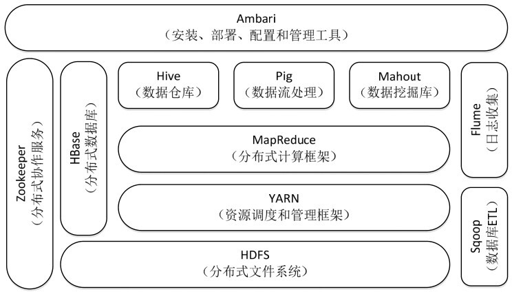

# hadoop

Hadoop 是一个项目，集合了一大批的子项目。核心是HDFS和Map-Reduce，HDFS 解决了海量数据如何存储的问题，Map-Reduce 框架解决了海量数据如何分布式处理的问题。

Hadoop 的优点：高可靠性、高效性、可扩展性、成本低。Hadoop 可以采用普通PC机构成一个集群。

## hadoop 不同版本

- Hadoop 1.0
    - Hadoop 0.20.x
    - Hadoop 0.21.x
    - Hadoop 0.22.x
- Hadoop 2.0
    - Hadoop 0.23.x
    - Hadoop 2.x 

### hadoop 生态系统

除了核心的 HDFS 和 MapReduce 外，Hadoop 生态系统还包括 Zookeeper、HBase、Hive、Pig、Mahout、Sqoop、Flume、Ambari 等功能组件。Hadoop2.0中增加了一些重要组件，即 HDFS HA 和分布式资源调度框架 YARN 等。



#### HDFS

Hadoop 分布式文件系统(Hadoop Distributed File System，HDFS)是针对谷歌系统(Google File System, GFS)的开源实现。HDFS 具有处理超大数据、流式处理、可以运行在廉价商用服务器上等优点。HDFS 在访问应用程序数据时，可以具有很高的吞吐率，因此对超大数据集的应用程序而言，HDFS 为底层数据存储是较好的选择。
#### HBase

HBase 是一个提供高可靠性、高性能、伸缩性、实时读写、分布式的列式数据库，一般采用 HDFS 作为其底层数据存储。HBase 是针对谷歌 BigTable 的开源实现，二者都采用相同的数据模型，具有强大的非结构化数据存储能力。HBase 与传统关系型数据库的一个重要区别是，前者采用基于列的存储，而后者采用基于行的存储。HBase 具有良好的横向扩展能力，可以通过不断增加廉价的商用服务器来增加存储能力。

#### MapReduce

Hadoop MapReduce 是针对谷歌 MapReduce 的开源实现。MapReduce 是一种编程模型，用于大规模数据集(大于1TB)的并行运算，它将复杂的、运行于大规模集群上的并行计算过程高度地抽象到两个函数 -- Map 和 Reduce 上，并允许用户在不了解分布式系统底层细节的情况下开发并行应用程序，并将其运行于廉价计算机集群上，完成海量数据的处理。

MapReduce 的核心思想是“分而治之”，它把输入的数据集切分为若干独立的数据块，分发给一个主节点管理下的各个分节点共同并行完成。最后整合各个分节点的结果获得最终结果。

#### Hive

Hive 是一个基于 Hadoop 的数据仓库根据，可以用于对 Hadoop 文件中的数据集进行数据整理、特殊查询和分析存储。Hive 的消息门槛比较低，因为它提供了类似于关系数据库的查询语言 -- Hive QL，可以通过 HQL 快速实现简单的 MapReduce 统计，Hive 可以将 HQL 转换为 MapReduce 任务进行运行，而不必开发专门的 MapReduce 应用，因而十分适合数据仓库的统计分析。

#### Pig

Pig 是一种数据流语言和运行环境，适合于使用 Hadoop 和 MapReduce 平台来查询大型半结构化的数据集。虽然 MapReduce 的开发不是很复杂，但也需要一定的开发经验。Pig 大大简化了 Hadoop 常见的工作任务，它在 MapReduce 的基础上创建了更简单的过程语言抽象，为 Hadoop 应用程序提供了一种更加接近结构化查询(SQL)的接口。Pig 是一个相对简单的语言，它可以执行语句，因此当我们需要从大型数据集中搜索满足某个给定搜索条件的记录时，采用 Pig 要比 MapReduce 具有明显的优势，前者只需要编写一个简单的脚步在集群中自动并行处理与分发，而后者则需要编写一个单独的MapReduce应用程序。

#### Mahout
Mahout 是 apache 下的一个开源项目，提供一些可扩展的机器学习领域经典算法的上线，旨在帮助开发人员更加方便地创建智能应用程序。Mahout 包含许多实现，包括聚类、分类、推荐过滤、频繁子项挖掘。除外，通过使用 Apache Hadoop 库，Mahout 可以有效地扩展到云中。

#### Zookeeper

Zookeeper 是对谷歌 Chubby 的开源实现，是高效可靠的协同工作系统(如统一命名服务、状态同步服务、集群管理、分布式应用配置项管理等)，用于构建分布式应用，减轻分布式应用程序锁承担的协调任务。Zookeeper 使用 Java 编写，很容易编程接入，它使用了一个和文件树结构类似的数据模型，可以使用 java 或 C 进行编程接入。

#### Flume

Flume 是 Cloudera 提供的一个高可用、高可靠、分布式的海量日志采集、聚合和传输系统。Flume 支持在日志系统中定制各类数据发送方，用于收集数据；同时，Flume 提供对数据进行简单处理并写到各种数据接收方的能力。

#### Sqoop

Sqoop 是 SQL-to-Hadoop 的缩写，主要用于在 Hadoop 和关系数据库之间交换数据，可以改进数据的互操作性。通过 Sqoop 可以方便地将数据从 MySQL、Oracle、PostgreSQL等关系型数据库中导入 Hadoop（可以导入HDFS、HBase或Hive），或者将数据从 Hadoop 导出到关系型数据库，使传统关系数据库和 Hadoop 之间的数据迁移变得非常方便。

#### Ambari

Apache Ambari是一种基于Web的工具，支持Apache Hadoop集群安装、部署、配置和管理。Ambari 目前已支持多数Hadoop组件，包括HDFS、MapReduce、Hive、Pig、HBase、Zookeeper、Sqoop 等。

# Hadoop 的安装与使用

## 添加 hadoop 用户

- 添加 hadoop 用户：`sudo useradd -m hadoop -s /bin/bash`
- 设置 hadoop 用户密码：`sudo passwd hadoop`
- 为 hadoop 用户添加管理员权限，方便部署：`sudo adduser hadoop sudo`

## 下载 hadoop

从网址 https://hadoop.apache.org/releases.html 下载对应的 hadoop 版本，这里我们选择：hadoop-2.10.1.tar.gz 。

## 安装 hadoop

### 初始化安装路径

- 创建安装目录：`udo mkdir /usr/local/hadoop`
- 修改拥有者：`sudo chown hadoop /usr/local/hadoop/`
- 修改组：`sudo chgrp hadoop /usr/local/hadoop/`
- 查看结果：`ls -ld /usr/local/hadoop/`，输出为：`drwxr-xr-x 2 hadoop hadoop 4096 Nov  8 21:12 /usr/local/hadoop/`；
- 修改 `etc/hadoop/hadoop-env.sh`，将 `export JAVA_HOME=${JAVA_HOME}` 改为 JAVA 的实际安装目录。

在 Hadoop 的文件夹中， `etc/hadoop` 目录下放置了配置文件，对于单机安装，首先需要修改 `hadoop-env.sh` 文件，以配置 Hadoop 运行的环境变量，这里只需要将 JAVA_HOME 环境变量指定到本机的 JDK 目录即可，并配置 JAVA_HOME 的环境变量。完成后，进入解压后的文件夹中，执行 `bin/hadoop version` 命令，得到的结果为：
```
Hadoop 2.10.1
Subversion https://github.com/apache/hadoop -r 1827467c9a56f133025f28557bfc2c562d78e816
Compiled by centos on 2020-09-14T13:17Z
... ...
```
表示安装成功。

测试：
- 在 hadoop 安装目录下新建 input 文件夹，用来存放输入数据；
- 将 etc/hadoop 下的配置文件复制到 input 文件夹下 `cp etc/hadoop/*.xml input/`；
- 执行命令：`bin/hadoop jar share/hadoop/mapreduce/hadoop-mapreduce-examples-*.jar grep ./input ./output 'dfs[a-z.]+'`
- 查看结果：`cat output/*` ，输出为 `1	dfsadmin`。

这意味着，在所有的配置文件中，只有一个符合正则表达式的单词，结果正确。

### Hadoop 伪分布式安装

伪分布式安装是指一台机器上模拟一个小的集群，但是集群中只有一个节点。需要说明的是，在一台机器上也是可以实现完全分布式安装的，只需要在一台机器上安装多个 Linux 虚拟机，每个虚拟机成为一个节点。

当 Hadoop 应用于集群时，不论是伪分布式还是真正分布式运行，都需要通过配置文件对各组件的协同工作进行设置，最重要的几个配置文件如下：

- hadoop-env.sh: bash 脚本，记录配置 Hadoop 运行所需的环境变量，以运行 hadoop；
- core-site.xml: Hadoop 配置文件，Hadoop core 的配置项，如 HDFS 和 MapReduce 常用的 I/O 设置扥个；
- hdfs-site.xml：Hadoop 配置 XML，Hadoop 守护进程的配置项，包括 NameNode、Secondary NameNode 和 DataNode；
- mapred-site.xml: Hadoop 配置 XML，MapReduce 守护进程的配置项，包括 JobTracker 和 TaskTracker；
- masters：text，运行 SecondaryNameNode 的机器列表(每行一个)；
- slaves：text，运行 DataNode 和 TaskTracker 的机器列表(每行一个)；
- hadoop-metrics.properties: java 属性，控制 metrics 在 Hadoop 上如何发布的属性；

对于伪分布式配置，我们需要修改 `core-site.xml` 和 `hdfs-site.xml` 两个文件。

core-site.xml 的内容为
```xml
<configuration>
    <property>
        <name>hadoop.tmp.dir</name>
        <value>file:/usr/local/hadoop/hadoop-2.10.1/tmp</value>
        <description>Abase for other temporary directories.</description>
    </property>
    <property>
        <name>fs.defaultFS</name>
        <value>hdfs://localhost:9000</value>
    </property>
</configuration>
```
可见，core-site.xml 配置文件的格式十分简单，`<name>` 代表配置项的名字，`<value>` 设置配置项的值。对于 core-site.xml 文件，我们只需要在其中指定 HDFS 的地址和端口号，端口号按照官方文档设置为9000即可。

修改后的 hdfs-site.xml 文件为：
```xml
<configuration>
    <property>
        <name>dfs.replication</name>
        <value>1</value>
    </property>
    <property>
        <name>dfs.namenode.name.dir</name>
        <value>file:/usr/local/hadoop/hadoop-2.10.1/tmp/dfs/name</value>
    </property>
    <property>
        <name>dfs.datanode.data.dir</name>
        <value>file:/usr/local/hadoop/hadoop-2.10.1/tmp/dfs/data</value>
    </property>
</configuration>
```
对于 hdfs-site.xml 文件，我们设置 replication 的值为1，这也是 Hadoop 运行的默认最小值，它限制了 HDFS 文件系统中同一份数据的副本数量，因为这里采用伪分布式，集群中只有一个节点，因此副本数量 replication 的值也只能设置为1，这样的配置能够满足本机试验。官方配置可参考：http://hadoop.apache.org/docs/stable 。

配置完成后，首先需要初始化文件系统，由于 hadoop 的很多工作是在自带的 HDFS 文件系统上完成的，因此需要将文件系统初始化之后才能进一步执行计算任务，执行初始化的命令为 ` bin/hdfs namenode format`。

启动所有进程 `sbin/start-all.sh`。可以通过 `lsof -i:9000` 查看是否启动成功。执行 JPS 的结果为：
```
5365 SecondaryNameNode
5493 ResourceManager
5813 NodeManager
5926 Jps
5015 NameNode
5175 DataNode
```
通过 `localhost:50070` 查看 Hadoop 的信息。

创建目录：`bin/hdfs dfs -mkdir -p /user/hadoop` ；


在前面的安装单机 hadoop 内容中，我们在本地 hadoop 文件夹下创建了 input 文件夹，并把 etc/hadoop 文件夹下的配置文件复制到 input 文件夹，作为试验所需的文本文件，现在我们将这些本地文本文件 “上传” 到分布式文件系统 HDFS 中的 input 文件夹。当然，这里的上传并不是数据通过网络传输，实际上，在我们这里介绍的伪分布式环境下，本地的 input 文件夹和 HDFS 中的 input 文件夹都在同一台机器上，并不需要网络传输。我们可以执行如下命令：`bin/hdfs dfs -put ./input`。

接着执行字数统计测试样例：`bin/hadoop jar share/hadoop/mapreduce/hadoop-mapreduce-examples-*.jar grep input output 'dfs[a-z.]+'`；

查看结果：`bin/hadoop fs -cat output/*`，输出为 `1	dfsadmin`。如果要重新运行程序时，需要先将 HDFS 中 output 文件夹删除，然后再运行程序。
