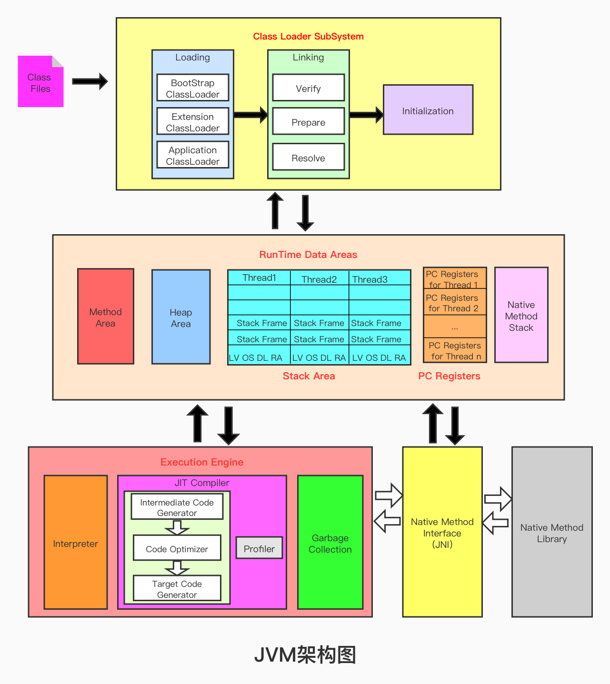

# 类加载子系统

- 2021-10-22 09:53:23  P27完成·

## 内存图
参考：https://www.programmerall.com/article/2575539504/

字节码加载又分成了3个环节：
- 加载：用到3种加载器，引导类加载器、扩展类加载器和应用类加载器；
- 链接：分为验证、准备和解析3个子过程；
- 初始化

类在加载到内存后，可以通过 getClassLoader 获取加载该类到类加载器。

