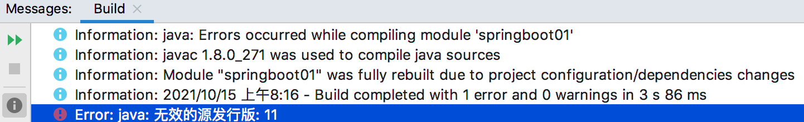

# springboot helloworld 程序

## maven 工程

- 第一步：创建一个maven仓库；
- 第二步：导入springboot依赖；
```xml
    <!--父依赖-->
    <parent>
        <groupId>org.springframework.boot</groupId>
        <artifactId>spring-boot-starter-parent</artifactId>
        <version>1.5.12.RELEASE</version>
        <relativePath/> <!-- lookup parent from repository -->
    </parent>

    <!--启动器-->
    <dependencies>
        <dependency>
            <groupId>org.springframework.boot</groupId>
            <artifactId>spring-boot-starter-web</artifactId>
        </dependency>
    </dependencies>
```
- 第三步：编写一个主程序，启动 springboot 应用；
```java
package com.fhb;

import org.springframework.boot.SpringApplication;
import org.springframework.boot.autoconfigure.SpringBootApplication;
/**
 * @SpringBootApplication 标注一个主程序类，用于说明这是一个Spring Boot 应用
 */
@SpringBootApplication
public class HelloWorldMainApplication {
    public static void main(String[] args) {
        // Spring 应用启动起来
        SpringApplication.run(HelloWorldMainApplication.class, args);
    }
}
```
- 第四步：编写相关的controller、Service
```java
package com.fhb.controller;

import org.springframework.stereotype.Controller;
import org.springframework.web.bind.annotation.GetMapping;
import org.springframework.web.bind.annotation.ResponseBody;

@Controller
public class HelloController {
    @GetMapping(value = "hello")
    @ResponseBody
    public String hello() {
        return "Hello, world ~";
    }
}
```
- 第五步：测试：执行 HelloWorldMainApplication.main 。在浏览器输入 `http://localhost:8080/hello`，浏览器显示：Hello, world ~ 。
- 第六步：简化部署，导入 spring-boot 的 maven 插件。这样，在 maven 侧边栏的 Pluginins 中将出现 spring-boot。点击 Lifecycle -> package，将执行打包操作 (有时候会出现打包失败的情况，根据提示解决，如先执行 compile)。在项目的 target 文件夹下将出现一个与项目名对应的 jar 包。可以将该 jar 包放到任意目录，执行 `java -jar xxx.jar` 即可启动我们打包好的web应用。
```xml
<!-- 可以将应用打包成一个可执行的jar包 无需在目标服务器安装tomcat -->
    <build>
        <plugins>
            <plugin>
                <groupId>org.springframework.boot</groupId>
                <artifactId>spring-boot-maven-plugin</artifactId>
            </plugin>
        </plugins>
    </build>
```

出现错误：



解决方案：File -> Project Structure... -> Modules -> Language Level 设置为 8。

## 细节分析

### 1、导入父依赖

```xml
    <!--父依赖-->
    <parent>
        <groupId>org.springframework.boot</groupId>
        <artifactId>spring-boot-starter-parent</artifactId>
        <version>1.5.12.RELEASE</version>
        <relativePath/> <!-- lookup parent from repository -->
    </parent>

    <!-- spring-boot-starter-parent 又依赖 spring-boot-dependencies -->
    <parent>
		<groupId>org.springframework.boot</groupId>
		<artifactId>spring-boot-dependencies</artifactId>
		<version>1.5.12.RELEASE</version>
		<relativePath>../../spring-boot-dependencies</relativePath>
	</parent>
```
在 spring-boot-dependencies 中引入了各种包，称为 spring boot 的版本仲裁中心，之后我们导入依赖，默认是不需要写版本的，没有在 dependencies 中管理的依赖，需要写版本号。

### 2、导入的依赖
```xml
    <dependencies>
        <dependency>
            <groupId>org.springframework.boot</groupId>
            <artifactId>spring-boot-starter-web</artifactId>
        </dependency>
    </dependencies>
```
因为有版本仲裁，因此 spring-boot-starter-web 不需要指定版本号。

- spring-boot-starter：spring-boot 场景启动器。spring-boot-starter-web 帮我们导入了 web 模块正常运行所依赖的组建。

spring-boot 可用的 starters 可参考文档：https://docs.spring.io/spring-boot/docs/current/reference/htmlsingle/#using.build-systems.starters 。

Spring-boot 将所有的功能场景抽取出来，做成一个个的 starters (启动器)，只需要在项目中引入这些 starter，相关场景的所有依赖都会被导入进来，版本由 spring-boot 控制。要用说明功能，就导入相应场景的启动器。

### 主程序类，主入口类

`@SpringBootApplication` 注解：Spring Boot 注解标注在某个类上，说明该类是 SpringBoot 的主配置类，SpringBoot 就应该运行该类的 main 方法来启动 SpringBoot 应用。
```java
@Target({ElementType.TYPE})
@Retention(RetentionPolicy.RUNTIME)
@Documented
@Inherited
@SpringBootConfiguration
@EnableAutoConfiguration
@ComponentScan(
    excludeFilters = {@Filter(
    type = FilterType.CUSTOM,
    classes = {TypeExcludeFilter.class}
), @Filter(
    type = FilterType.CUSTOM,
    classes = {AutoConfigurationExcludeFilter.class}
)}
)
public @interface SpringBootApplication {
```
`@SpringBootConfiguration`：Spring Boot 的配置类注解，标注在某个类上，表示这就是一个 Spring Boot 的配置类。配置类 <--> 配置文件。
`@EnableAutoConfiguration`：开启自动配置功能，以前我们需要手动配置的东西，Spring Boot 会帮我们自动配置。
```java
@Target({ElementType.TYPE})
@Retention(RetentionPolicy.RUNTIME)
@Documented
@Inherited
@AutoConfigurationPackage
@Import({EnableAutoConfigurationImportSelector.class})
public @interface EnableAutoConfiguration {
```
`AutoConfigurationPackage`：自动配置包。
```java
@Target({ElementType.TYPE})
@Retention(RetentionPolicy.RUNTIME)
@Documented
@Inherited
@Import({Registrar.class})
public @interface AutoConfigurationPackage {
}
```
将主配置类（SpringBootApplication标注的类）所在的包下的所有组件全都扫描到 Spring 容器中。

`@Import({EnableAutoConfigurationImportSelector.class})`：导入哪些组件的选择器。将所有需要导入的组件，以全类名的方式返回。

会给容器


