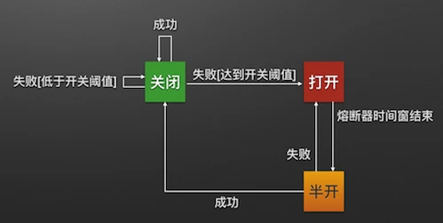

# 熔断与降级

参考：
- 

分布式系统中经常会出现某个基础服务不可用造成整个系统不可用的情况，这种现象被称为服务雪崩效应。

## 服务雪崩效应的定义

服务雪崩效应是一种因服务提供者的不可用导致服务调用者不可用，并将不可用逐渐放大的过程。例如 A 为服务提供者，B 为 A 的服务调用者，C 和 D 为 B 的服务调用者。当 A 不可用时，引起 B 的不可用，并将不可用逐渐放大到 C 和 D 时，服务雪崩就形成了。

### 服务雪崩效应形成的原因

服务雪崩产生的过程为以下3个阶段：

1. 服务提供者不可用；
2. 重试加大流量；
3. 服务调用者不可用；

服务雪崩的每个阶段可能由于不同的原因造成，比如服务不可能的原因有：

- 硬件故障：可能为硬件损坏造成的服务器主机宕机；网络硬件故障造成的服务访问者不可访问；
- 程序 bug
- 缓存击穿：一般发生在缓存应用重启，所有缓存被清空时，以及短时间内大量缓存失效时，大量的缓存不命中，使请求直击后端，造成服务提供者超负荷运行，引起服务不可用；
- 用户大量请求：在秒杀和大促开始前，如果准备不充足，用户发起的大量请求也会造成服务提供者不可用；

形成重试加大流量的原因有：
- 用户重试；
- 代码逻辑重试；

在服务提供者不可用后，用户由于忍受不了界面上长时间的等待，而不断刷新页面甚至提交表单。服务调用端会存在大量服务异常后的重试逻辑，这些重试都会进一步加大请求流量。

服务调用者不可用产生的主要原因是：同步等待造成的资源耗尽；当服务调用者使用同步调用时，会产生大量的等待线程占用系统资源，一旦线程资源被耗尽，服务调用者提供的服务也将处于不可用状态，于是服务雪崩效应产生。

### 服务雪崩的应对策略

针对造成服务雪崩的不同原因，可以使用不同的应对策略：
1. 流量控制；
2. 改进缓存模式；
3. 服务自动扩容；
4. 服务调用者降级服务；

流量控制的具体措施包括：
- 网关限流；
- 用户交互限流；
- 关闭重试；

因为 Nginx 的高性能，目前一线互联网公司大量采用 Nginx + Lua 的网关进行流量控制，由此而来的 OpenResty 也越来越热门。

用户交互限流的具体措施有：1、采用加载动画，提高用户的忍耐等待时间；2、提交按钮添加强制等待时间机制；

改进缓存模式的的措施包括：
- 缓存预加载；
- 同步改为异步刷新；

服务自动扩容的措施主要有：
- AWS 的 auto scaling

服务调用者降级服务的措施包括：
- 资源隔离：主要是对调用服务的线程池进行隔离；
- 对依赖服务进行分类：根据具体业务，将依赖服务分为强依赖和弱依赖，强依赖服务不可用会导致当前业务中止，而弱依赖的服务不可用不会导致当前业务中止；
- 不可用服务的调用快速失败：通过超时熔断，熔断器和熔断后的降级方法来实现；

## Hystrix

为了应对服务雪崩，一种常见的方法是手动降级，而 Hystrix 的出现，提供了一种解决方案。

Histrix /hist'riks/ 是指豪猪，拥有自我保护能力。Netflix 的 Hystrix 是一个帮助解决分布式系统交互时超时处理和容错的类库，它同样用于保护系统的能力。

Hystrix 的设计原则包括：
- 资源隔离；
- 熔断器；
- 命令模式；

### 资源隔离

货船为了防止进水和火灾扩散，会将货仓分隔为多个。这种资源隔离减少风险的方式被称为：Bulkheads (舱壁隔离模式)。Hystrix 将同样的模式运用到服务调用上。在一个高度服务化的系统中，我们实现的一个业务逻辑通常会依赖多个服务，比如商品详情展示服务会依赖商品服务，价格服务，商品评论服务。调用三个依赖服务会共享商品详情服务的线程池。如果其中的商品评论服务不可用，就会出现线程池中所有线程都因等待商品评论服务而被阻塞，从而造成雪崩。

Hystrix 通过将每个依赖服务分配独立的线程池进行资源隔离，从而避免了服务雪崩。

### 熔断器模式

熔断器模式定义了熔断器开关相互转换的逻辑：



服务的健康状况 = 请求失败数 / 请求总数；

熔断器开关由关闭到打开的状态转换是通过当前服务健康状况和设定阈值比较决定的。

1. 当熔断器开关关闭时，请求被允许通过熔断器。如果当前健康状况高于设定阈值，开关继续保持关闭。如果当前健康状况低于设定阈值，打开开关；
2. 当熔断器开关被打开时，请求被禁止通过；
3. 当熔断器开关处于打开状态，经过一段时间后，熔断器自动进入半开状态，这时熔断器只允许一个请求通过，当该请求调用成功时，熔断器恢复到关闭状态，若请求失败，熔断器继续保持打开状态，接下来的请求被禁止通过；

熔断器的开关能保证服务调用者在调用异常服务时，快速返回结果，避免大量的同步等待。并且熔断器能在一段时间后继续侦测请求执行结果，提供恢复服务调用的可能；

### 命令模式

Hystrix 使用命令模式(继承自HystrixCommand类)来包裹具体的服务调用逻辑(run方法)，并在命令模式中添加服务调用失败后的降级逻辑(getFallback)。

同时，我们在 Command 的构造方法中可以定义当前服务容器池和熔断器的相关参数：
```java
public class Service1HystrixCommand extends HystrixCommand<Response> {
    private Service1 service;
    private Request request;

    public Service1HystrixCommand(Service1 service, Request request) {
        supper(
            Setter.withGroupKey(HystrixCommandGroupKey.Factory.asKey("ServiceGroup"))
                .andCommandKey(HystrixCommandKey.Factory.asKey("service1query"))
                .andThreadPoolKey(HystrixThreadPoolKey.Factory.asKey("service1ThreadPool"))
                .andThreadPoolPropertiesDefaults(HystrixThreadPoolProperties.Setter().withCoreSize(20)) // 服务线程池数量
                .andCommandPropertiesDefaults(HystrixCommandProperties.Setter()
                    .withCircuitBreakerErrorThresholdPercentage(60)  // 熔断器关闭到打开阈值
                    .withCircuitBreakerSleepWindowInMilliseconds(3000)  // 熔断器打开到关闭的时间窗口长度
            ));
            this.service = service;
            this.request = request;
    }

    @Override
    protected Response run() {
        return service1.call(request);
    }
}
```
